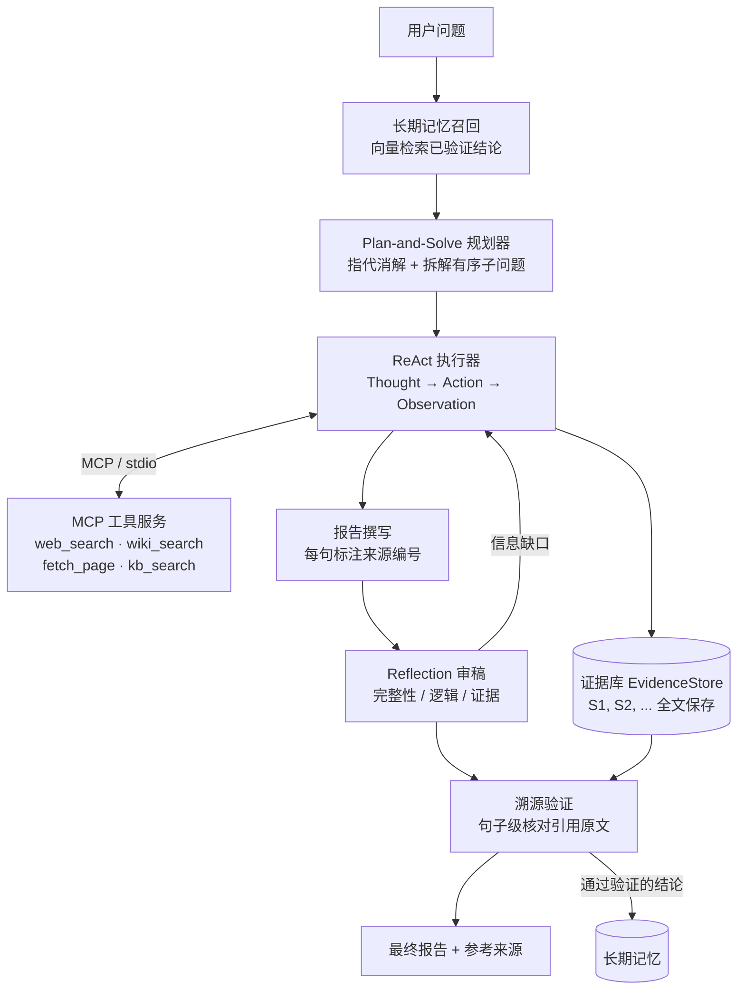

# DeepResearch-Agent：带溯源验证的自动化深度研究智能体

面向开放式、多跳研究问题的智能体系统：自动拆解问题、调用工具检索证据、自我反思修订，并对最终报告做**句子级溯源验证**——每一条结论都要能在引用的来源原文中找到依据，找不到的会被标记或剔除。

项目配套一套**消融实验**，在自建的 15 道多跳问题上量化了 Plan-and-Solve、Reflection、溯源验证各模块对准确率、幻觉率、延迟和成本的影响。

## 功能亮点

- **多范式 Agent 流水线**：Plan-and-Solve 拆解任务 → ReAct 循环调用工具收集证据 → Reflection 审稿并补充检索 → 溯源验证
- **MCP 工具层**：基于 MCP Python SDK 2.x 实现独立的工具服务（stdio 传输），提供网页搜索、维基百科、网页正文读取、本地知识库检索四个工具；Agent 通过 `list_tools` 动态发现工具，工具与推理逻辑完全解耦，也可直接接入其他 MCP 客户端
- **溯源验证**：报告按句切分 → 确定性检测编造的来源编号 → LLM 逐句核对陈述与引用原文 → 剔除（或标记）无依据陈述
- **证据优先守卫**：Agent 在没有检索任何证据时试图直接作答，会被打回要求先检索，避免模型凭参数记忆作答导致结论无法溯源
- **双层记忆**：短期对话记忆支持多轮追问（规划器做指代消解）；长期向量记忆**只写入通过溯源验证的结论**，避免记忆被幻觉污染，新问题到来时按语义召回、跨会话复用
- **可量化评估**：15 道多跳问题 + LLM-as-a-Judge 准确率评分 + 独立的溯源核查测幻觉率 + 分阶段快照消融
- **工程细节**：统一流式调用 + 指数退避重试；按阶段统计调用次数 / Token / 耗时；搜索结果磁盘缓存（节省配额、评估可复现）；SerpApi 异步提交 + 轮询；24 个离线单元测试（Fake LLM / Fake 工具，无需 API）

## 系统架构



一次研究的完整流程：

1. **记忆召回**：用问题在长期记忆中做向量检索，命中的历史结论作为带编号的证据进入本次研究
2. **规划（Plan-and-Solve）**：结合对话历史把追问改写成完整问题，再拆成 1-4 个有序子问题，后面的子问题可以依赖前面的答案（多跳推理）
3. **执行（ReAct）**：每个子问题由 ReAct 循环求解，每一步输出结构化 JSON（thought / action / action_input）；工具返回的每条结果分配来源编号 `[S#]` 存入证据库，答案中的每个事实都要标注编号
4. **撰写**：汇总各子问题结论，生成「结论 + 详细分析」结构的报告
5. **反思（Reflection）**：审稿人视角检查完整性、逻辑和证据，针对信息缺口发起补充检索，再修订报告
6. **溯源验证**：逐句核对报告陈述与其引用来源的原文，无依据的陈述被剔除；通过验证的结论写入长期记忆

## 快速开始

```bash
git clone <本仓库地址> && cd DeepResearch-Agent
python3 -m venv .venv && source .venv/bin/activate
pip install -r requirements.txt
cp .env.example .env   # 填入 LLM 与 SerpApi 的密钥
```

`.env` 支持任意兼容 OpenAI 接口的模型服务（OpenAI、DeepSeek、通义千问、Kimi 等）。SerpApi 免费版每月 250 次搜索；没有 SerpApi 时 Agent 仍可使用免费的维基百科工具。

```bash
python -m deep_research.knowledge_base           # 首次运行：下载本地向量模型并为 knowledge_base/ 建索引
python main.py "2024 年诺贝尔物理学奖得主中谁获得过图灵奖？"   # 命令行单次研究
python main.py -i                                # 多轮对话模式，可追问
streamlit run app.py                             # Web 界面
python -m eval.run_eval                          # 消融实验
pytest                                           # 单元测试（离线）
```

命令行开关：`--no-plan`、`--no-reflection`、`--no-verify`、`--no-memory` 可单独关闭某个模块，`--flag` 让溯源验证只标记不删除。

把自己的 Markdown / TXT 文档放进 `knowledge_base/` 目录，Agent 就能通过 `kb_search` 检索它们，索引会在文件变化时自动重建。

## 评估

### 实验设置

- **数据集**：自建 15 道多跳事实问题（`eval/benchmark.json`），覆盖 AI 论文、科学奖项、科技公司、文学、建筑等领域，每题附标准答案和必须命中的要点；全部是不随时间变化的历史事实
- **对比配置**：ReAct（单个智能体，最多 8 步）、+Plan-and-Solve、+Reflection、+溯源验证（逐级叠加）
- **指标**：
  - 准确率：裁判模型对照标准答案和要点打分（1 / 0.5 / 0）后取平均
  - 幻觉率：由一次独立的裁判调用逐句核对报告陈述与其引用来源原文，无依据陈述数 ÷ 可核查陈述总数
  - 开销：截至该阶段的累计耗时、Token、LLM 调用次数、工具调用次数
- **分阶段快照**：后三种配置取自同一次完整运行在各阶段结束时的快照。因为各阶段串行执行、后续阶段不会改变前面的输出，快照与“只开到该阶段”的独立运行等价，同时省去约 2/3 的 API 开销
- 评估时关闭长期记忆，避免题目之间互相泄漏信息

### 结果

<!-- EVAL_RESULTS -->

## 关键设计决策

**ReAct 每一步为什么输出 JSON，而不是经典的 `Thought: ... Action: ...` 文本？**
文本格式要靠正则解析，模型稍微改变格式就会解析失败。改成 JSON 后可以配合 `response_format=json_object` 约束输出，解析失败时把错误信息反馈给模型重试一次，鲁棒性高得多。同时没有依赖原生 Function Calling，因此可以切换到任何兼容 OpenAI 接口的模型。

**为什么用 MCP，而不是在 Agent 里直接写函数？**
工具以独立进程运行，Agent 通过 `list_tools` 动态获取工具名称、描述和参数的 JSON Schema 来生成提示词。新增或替换工具不需要修改 Agent 代码；同一个工具服务也能直接接入 Claude Desktop、Cursor 等其他 MCP 客户端。MCP SDK 是异步的，而 Agent 主流程是同步的，所以客户端用一个后台线程运行事件循环来桥接两者。

**为什么所有证据都要分配 `[S#]` 编号？**
编号把“结论”和“证据”绑定在一起，这是溯源验证能够落地的前提。证据库按 URL 去重：同一个链接先作为搜索摘要出现、后被 `fetch_page` 读取全文时，会沿用原编号并升级为全文内容。放进上下文的 Observation 会按长度预算截断（控制上下文长度），而证据库保留更完整的内容供验证阶段使用。

**溯源验证为什么按句子切分，而不是让 LLM 自己抽取 claim？**
用正则按句切分可以精确定位每句话在原文中的位置，判定为无依据后能直接删除这一句而不改动其他内容；LLM 抽取的 claim 很难对应回原文。另外，引用了不存在的来源编号属于确定性错误，不需要调用 LLM 就能判定为“编造引用”。

**长期记忆为什么只写入通过验证的结论？**
如果把未经验证的结论写进记忆，一次幻觉会在之后的研究里被当作“已知事实”反复引用，错误会被放大。只记住有来源支撑的结论，并保留原始来源链接，可以避免这种记忆污染。

**为什么统一使用流式调用？**
开发过程中发现，部分网络环境（代理、网关）会断开长时间没有数据传输的连接。推理模型思考时间较长，非流式请求经常因此失败；流式请求持续有数据返回，稳定得多。SerpApi 同步模式也有同样的问题，因此改成了异步提交 + 轮询结果。

## 开发中发现并解决的问题

| 问题 | 现象 | 解决 |
|---|---|---|
| 模型跳过检索、凭记忆作答 | 规划模式下，简单子问题直接作答而不调用工具，结论没有任何来源可引用，裁判判定大量陈述无依据 | 在 ReAct 执行器中加入证据优先守卫：没有任何证据就作答会被打回一次，要求先检索 |
| Reflection 过度追问 | 审稿人要求“证明不存在更早的文献”这类无法穷尽的否定性命题，触发大量无效搜索，报告引用了不相关的来源，单题耗时超过 200 秒 | 收紧审稿提示词：只在答案缺失或关键结论无依据时补充检索；同时这类弱结论会被溯源验证拦截 |
| 长连接被网络中断 | 非流式 LLM 请求、SerpApi 同步搜索频繁连接超时 | LLM 统一流式调用 + 指数退避重试；SerpApi 改为异步提交 + 轮询，轮询接口不消耗搜索配额 |
| 推理模型不支持 temperature | 传入 `temperature=0` 直接报 400 错误 | 客户端默认不传 temperature，改用 `reasoning_effort` 控制推理强度 |

## 局限性

- **自评偏差**：裁判模型默认与被测系统是同一个模型。尤其“+溯源验证”配置的幻觉率是由同类核查方法测量的，存在一定的循环偏差，其数值应理解为“验证器自身标准下的残余幻觉”。可以在 `.env` 中通过 `JUDGE_MODEL_ID` 换用不同的模型做裁判，以降低这种偏差
- **样本量小**：15 道题、每题运行一次，LLM 输出有随机性，结果更适合看趋势而非精确数值
- **数据污染**：题目是公开的历史事实，可能出现在模型的训练数据中，因此准确率在不同配置之间区分度有限；幻觉率和来源支持率更能体现各模块的差异
- **子问题串行执行**：多跳问题的子问题之间存在依赖，目前按顺序执行；可以改为按依赖关系构建 DAG，让互不依赖的子问题并行
- **网页读取能力有限**：`fetch_page` 不支持 PDF 和需要 JavaScript 渲染的页面
- **删除陈述可能影响行文连贯**：剔除无依据的句子后，上下文偶尔会不够通顺；可以选择 `--flag` 只做标记

## 项目结构

```
DeepResearch-Agent/
├── deep_research/
│   ├── pipeline.py        # 流水线编排：记忆 → 规划 → 执行 → 撰写 → 反思 → 验证，记录阶段快照
│   ├── planner.py         # Plan-and-Solve 规划器（含指代消解）
│   ├── react_agent.py     # ReAct 执行器（JSON 结构化输出、证据优先守卫、重复调用缓存）
│   ├── writer.py          # 报告撰写
│   ├── reflection.py      # Reflection：审稿 + 补充检索 + 修订
│   ├── verifier.py        # 溯源验证：句子切分、编造引用检测、LLM 逐句核对
│   ├── evidence.py        # 证据库与来源编号
│   ├── memory.py          # 短期对话记忆 + 长期向量记忆
│   ├── vector_store.py    # NumPy 向量库 + 本地 / OpenAI 向量模型
│   ├── knowledge_base.py  # 本地知识库：切块、建索引、增量重建
│   ├── llm.py             # 流式 LLM 客户端：重试、用量统计、JSON 解析
│   ├── prompts.py         # 全部提示词
│   ├── events.py          # 进度事件（CLI 与 Web UI 共用）
│   └── tools/
│       ├── mcp_server.py  # MCP 工具服务
│       ├── mcp_client.py  # MCP 客户端（异步 → 同步桥接）
│       └── search.py      # SerpApi / 维基百科 / 网页读取 + 磁盘缓存
├── eval/
│   ├── benchmark.json     # 15 道多跳问题
│   ├── judge.py           # 准确率与幻觉率裁判
│   ├── run_eval.py        # 消融实验
│   └── results/           # 评估结果（汇总表、图表、逐题详情）
├── knowledge_base/        # 本地知识库文档
├── tests/                 # 离线单元测试
├── app.py                 # Streamlit Web 界面
└── main.py                # 命令行入口
```
